# HP_Project

# Цель
Изучить изменение тем и мотивов в серии книг о Гарри Поттере (далее - ГП):
* учебная жизнь в Хогвартсе
* магия и использование заклинаний
* мотивы смерти, добра и зла, дружбы, семьи и любви

# Инструменты
* MyStem
* AntConc
* Voyant Tools
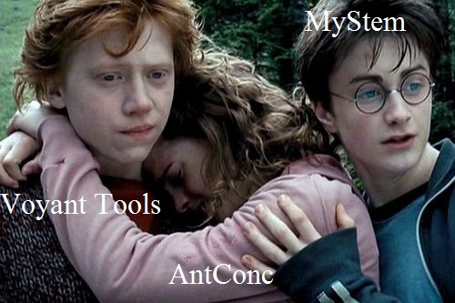

# Методы
* Мы собрали тексты всех 7 частей ГП в переводе издательства "Росмэн" и лемматизировали их с помощью MyStem (к сожалению, он работает только на русском - изначально мы хотели исследовать оригинал произведения, потому что нам такое измерение показалось более точным). 
* Затем мы использовали AntConc, чтобы выявить самых популярных героев и самые часто употребляемые слова. Так мы выбрали мотивные ряды для анализа.
* Последним шагом стала визуализация результатов исследования, для чего нам пришлось поработать с Voyant Tools.

*когда понимаешь, что MyStem можно использовать только для лемматизации русских текстов, но тебе очень нужен третий инструмент*

# Лемматизация текста и ~~немного нытья~~ трудности, с которыми мы столкнулись
Лемматизация текста, в котором есть множество слов, нетипичных для русского языка, оказалась очень болезненной. Семья Дурсль превращалась в "семья дурсль|дурсля|дурслить", Когтевран и Пуффендуй становились глаголами (MyStem предлагал нам пуффендовать и пуффендовывать, а также когтевирать). Большинство заклинаний также пришлось выискивать вручную, так как, например, сложно найти заклинание для вправления конечностей и остановки кровотечений "эпискеи", если MyStem превратил его в "эпискея".

# Учебная жизнь в Хогвартсе
Выявить самых популярных учеников и учителей Хогвартса оказалось совсем нетрудно:

Профессор Макгонагалл, к нашему удивлению, гораздо менее популярна по сравнению со своими коллегами, но ведь она не принимала такого активного участия во внеучебной жизни учеников. На этой диаграмме видно, как менялась популярность некоторых преподавателей Хогвартса:
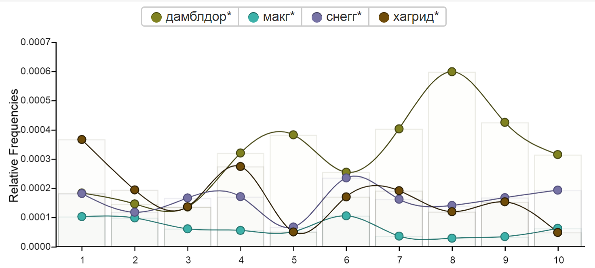
А вот самым популярным факультетом, как ни странно, оказался Слизерен:
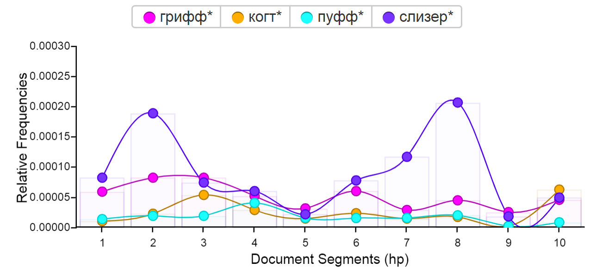
Визуализировать волшебные дисциплины в полной мере нам не удалось, так как названия многих из них используются в другом контексте (например, заклинания). Поэтому мы решили перейти к самой животрепещущей теме - экзаменам. О них ученики всерьез задумываются только с появлением Амбридж (до этого экзамены имели привычку время от времени отменяться):
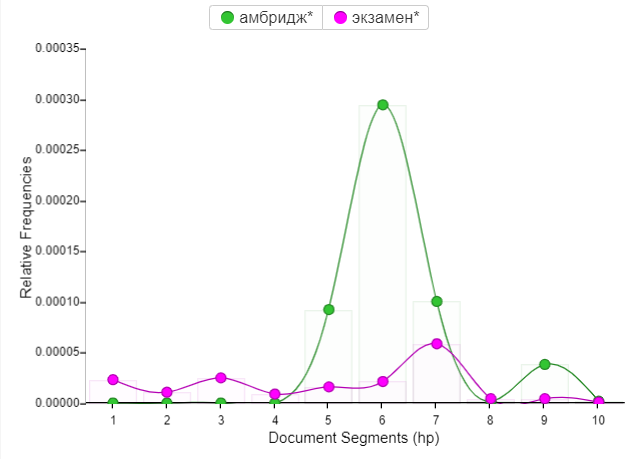
Также можно наблюдать интеллектуальное развитие героев (не очень значительное, но все же):
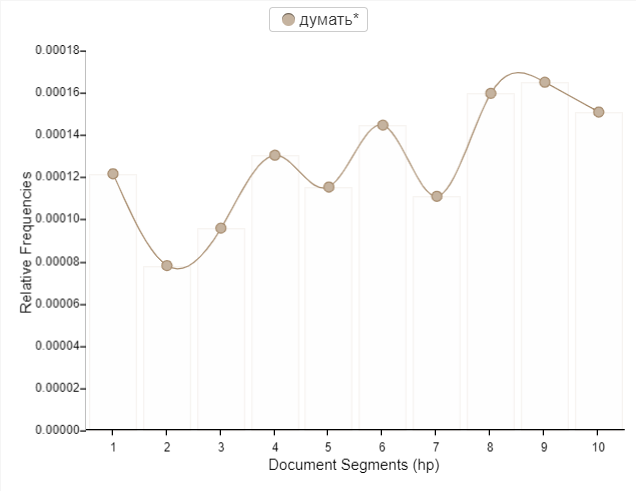
Всему виной халатное отношение к учебе: чем старше становятся ученики, тем меньше они задумываются о школьных успехах :(
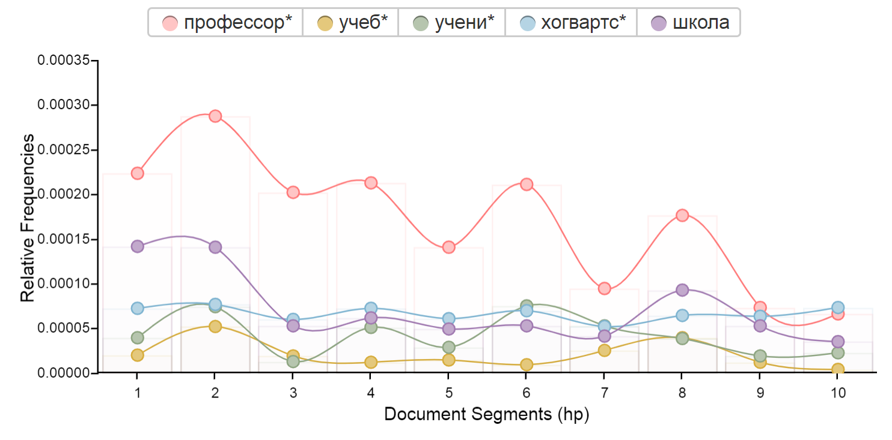

# Магия и использование заклинаний
Мир ГП известен магией - к ней мы сейчас и обратимся. Сначала посмотрим на соотношение маглов и волшебников в книгах:
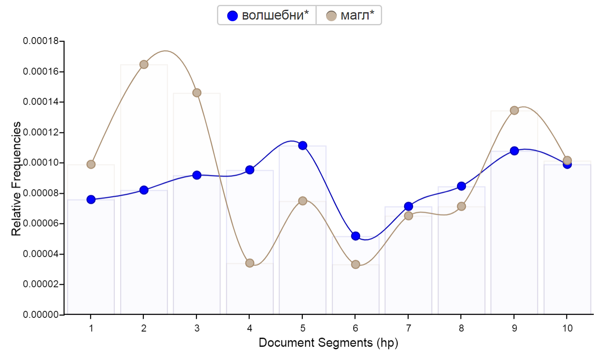
Как видно, маглы и волшебники постоянно борются за популярность, а к концу книги находят баланс.
А еще мы нашли героев-аутсайдеров, о которых обычно вспоминают только в начале и/или конце каждой части, да и то не всегда:
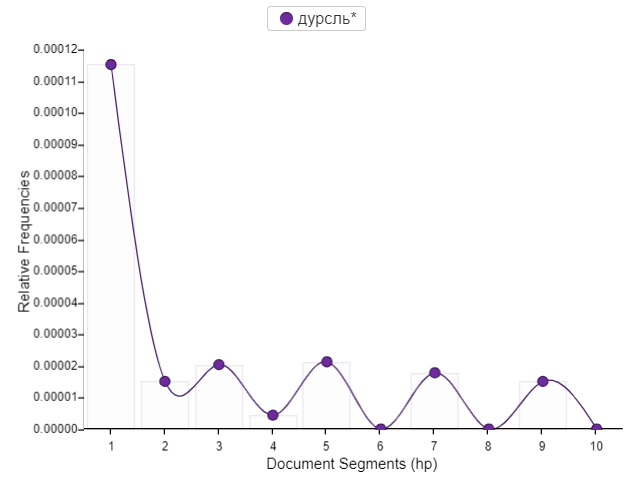
Перейдем непосредственно к магии.
В книге раз использовалось слово "заклинание" и раз слово "заклятие":
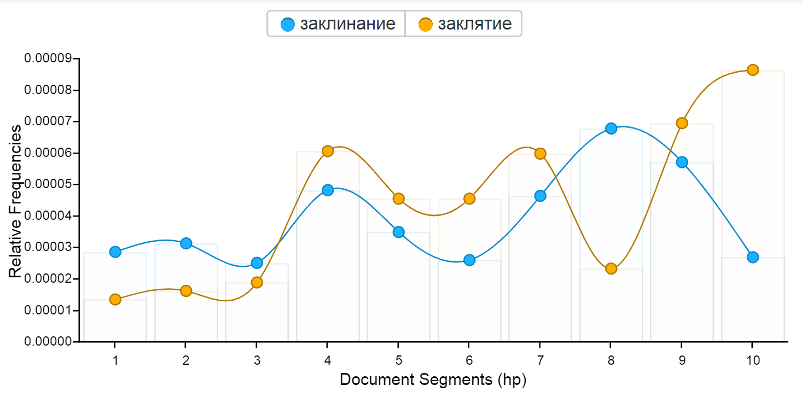
Чем старше становились герои, тем больше заклинаний они узнавали.
Посмотрим, как распределены заклинания по книгам.
1. В первой части ("ГП и Философский камень") появились следующие заклинания:
* Алохомора
* Вингардиум Левиоса
* Локомотор Мортис 
* Петрификус Тоталус (aka "Остолбеней")

2. С "Тайной комнатой" все сложнее - там уже 7 заклинаний:
* Апарекиум
* Люмос
* Риктусемпра
* Серпенсортия
* Таранталлегра
* Фините Инкантатем
* Экспеллиармус

3. "Узник Азкабана" известен нам заклинанием "Экспекто Патронум":

Другое известное заклинание - "Ридикулус" - используется, чтобы сделать страшного боггарта смешным:

Остальные 6 заклинаний из этой части:
* Ваддивази 
* Диссендиум  
* Импервиус (это водоотталкивающие чары, а не запретное заклинание)
* Мобилиарбус  
* Нокс  
* Ферула 

4. В "Кубке Огня" появляется 21 новое заклинание. Такое количество, скорее всего, связано с конкурсом волшебников. Вот те из них, что были использованы больше двух раз:
* Акцио 
* Диффиндо
* Импедимента (aka "Замри")   
* Приори Инкантатем 
* Редукто
* Репаро
* Сонорус 

В отдельную группу мы выделили запретные заклинания, также появившиеся в четвертой части. Вот как менялось отношение к ним:
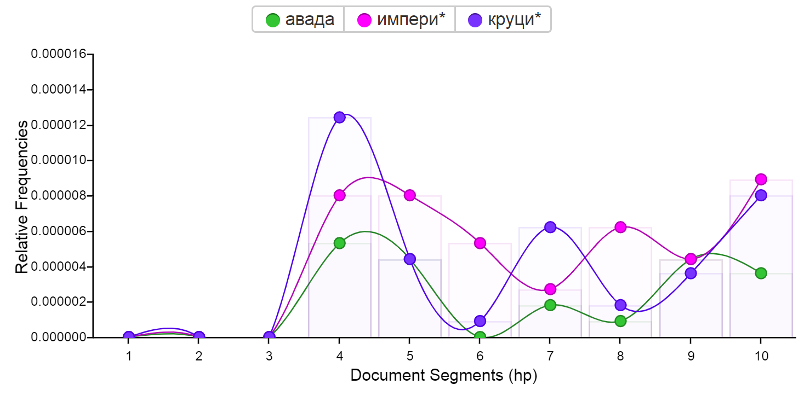
5. В "ордене Феникса" упоминается 11 новых заклинаний. Мы выделили те из них, которые использовались более одного раза:
* Инкарцеро
* Коллопортус 
* Легилименс  
* Протего
* Силенцио   

6. В "Принце-полукровке" Гарри Поттер узнает о могущественном заклинании "Сектумсемпра". Его создателем оказался профессор Снегг.

# Мотивы
* Тема смерти. Чем дальше, тем ее больше:
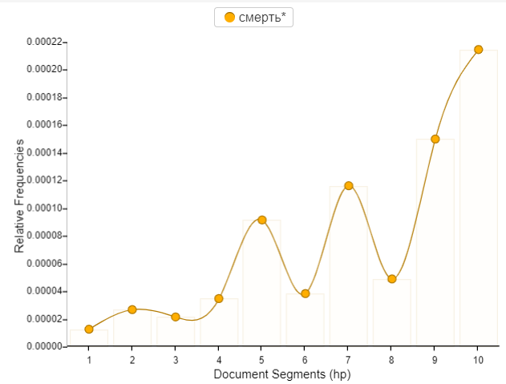
* Цвета становятся все темнее, придавая трагизма.
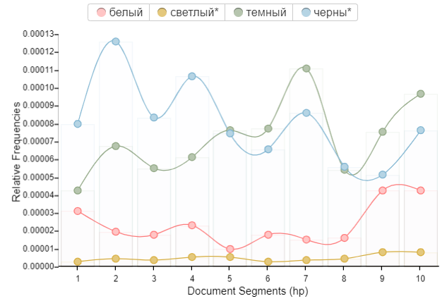
* Зла во всех частях стабильно больше, чем  добра, но в последней части оно уже, к нашему удивлению, не так популярно. 
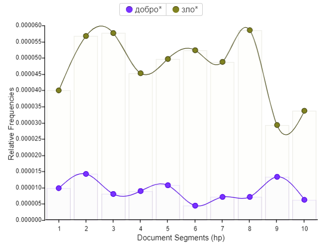
Возможно, причина в победе добра.
* Все говорят, что "Гарри Поттер" - это о дружбе. И это правда, особенно в 1, 2 и 7 частях
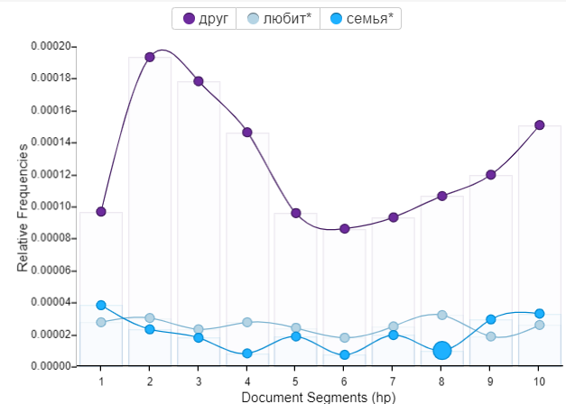

 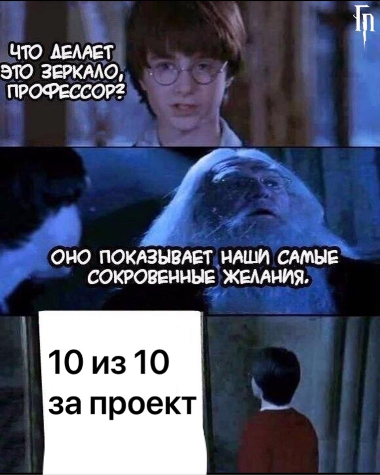 
