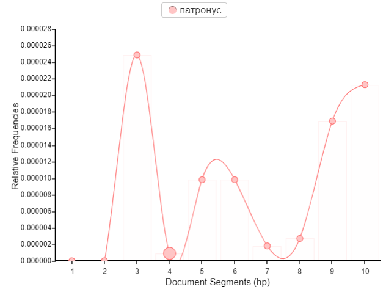

# Final_Project
Исследование динамики мотивного ряда в разных частьях "Гарри Поттера"

Читая "Гарри Поттера", легко заметить, что с взрослением персонажей менятеся мотивный ряд произведения. Первые части серии написаны по-детски, а последние затрагивают более взрослые темы. Это можно проследить, использовав Voyant Tools:
1. Тема смерти. Чем дальше, тем ее больше:

А цвета становятся все темнее, придавая трагизма.

А темы зла во всех частях стабильно больше, чем темы добра, но в последней части она уже, к нашему удивлению, не так популярна

2. Также можно наблюдать интеллектуальное развитие героев (не очень значительное, но все же)

И тему экзаменов, объемы которых вырастают с появлением профессора Амбридж

3. Использование заклинаний:
Экспекто Патронум используется в основном в третьей части (Узник Азкабана)

Также заклинания можно разделить на "детские" и "взрослые"
Детские: 
Взрослые: 

А вот так изменялось отноешние к запретным заклятиям

4. А еще мы нашли героев-аутсайдеров:

5. Все говорят, что "Гарри Поттер" - это о дружбе. И это правда, особенно в 1, 2 и 7 частях

Чтобы посчитать и визуализировать все это, нам пришлось лемматизировтаь все 7 частей "Гарри Поттера" с помощью MyStem (к сожалению, он работает только на русском - изначально мы хотели исследовать оригинал произведения, потому что нам такое измерение показалось более точным).

А еще мы поискали в AntConc самые часто употребляемые слова, чтобы понять, к каким мотивным рядам они отсылают и проанализировтаь самые часто встречающиеся из них.
